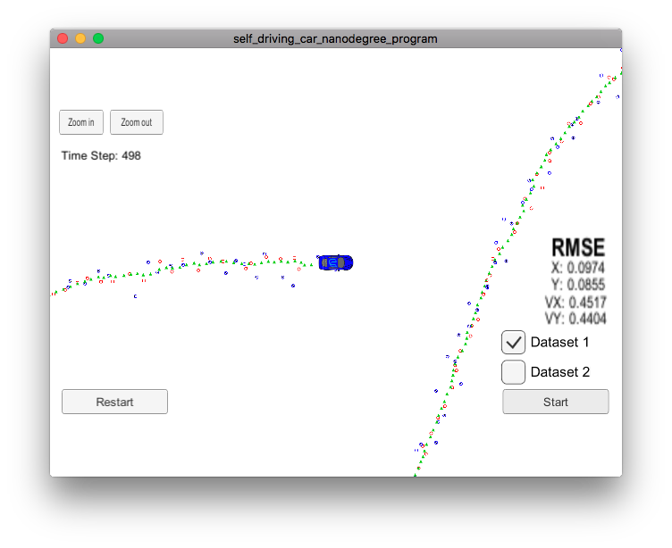

# Extended Kalman Filter Project
Udacity Self-Driving Car Engineer Nanodegree Program

This project uses an [extended Kalman filter](https://en.wikipedia.org/wiki/Extended_Kalman_filter) to combine radar and lidar measurements to track a bicycle circling a car in a simulator.

The simulator can be downloaded from the [github repository](https://github.com/udacity/self-driving-car-sim/releases).

The supporting websockets code (using the [uWebSockets library](https://github.com/uNetworking/uWebSockets)) and basic project structure come from the [Udacity repository](https://github.com/udacity/CarND-Extended-Kalman-Filter-Project).
The README at that repository has extensive details for build and setup.

## Basic Build Instructions

1. Clone this repo.
2. Make a build directory: `mkdir build && cd build`
3. Compile: `cmake .. && make` 
   * On windows, you may need to run: `cmake .. -G "Unix Makefiles" && make`
4. Run it: `./ExtendedKF`

## Files
[tools.cpp](https://github.com/gardenermike/extended-kalman-filter/blob/master/src/tools.cpp) implements helper functions to compute the root mean squared error between two vectors, and the Jacobian matrix of a vector.

[kalman_filter.cpp](https://github.com/gardenermike/extended-kalman-filter/blob/master/src/kalman_filter.cpp) implements prediction and update steps for the Kalman filter. Note that this implementation uses only linear prediction, so there is no extended non-linear step for prediction. There are separate functions for update of radar and lidar data, with only the non-linear radar updates needing the kalman filter extension. Most of the `UpdateEKF` function is converting the `x_` vector of location and velocity into polar coordinates, and normalizing the angle phi to be in the same range for both incoming and predicted data. The remainder of the update step is identical, but the `H_` matrix used for prediction has been replaced by the jacobian of the sensor data.

[FusionEKF.cpp](https://github.com/gardenermike/extended-kalman-filter/blob/master/src/FusionEKF.cpp) implements the measurement handler that sets up the KalmanFilter class for the predict and update loop.

## Discussion
The basic idea of the Kalman filter is to model the position of a moving object with an assumption of linear motion, using a Gaussian distribution to model uncertainty. As time passes, the variance of the distribution is expected to increase, as uncertainty increases. Measurement increases certainty, shifting the mean of the distribution and reducing the variance.

The Kalman filter is just a loop between measurement and prediction called when each measurement arrives. Prediction will calculate the expected position and velocity of an object based on the elapsed time interval, and measurement refines that expectation based on new data.

The _extended_ part of the extended Kalman filter handles non-linear data. Radar data is polar and non-linear, so requires a linear approximation. By using a linear approximation of the radar data, both radar and lidar data can be used to update the model, allowing greater precision than either sensor would allow alone.

### Results
The most interesting analysis of the filter process was obtained by evaluating its performace with radar data and laser/lidar data separately. Since radar directly measures velocity, velocity estimates with radar are good, but the position estimate is poor. Since the radar data is noisy, neither the position or velocity measurements are consistently better than that obtained by the lidar. The lidar sensor has better position resolution, so even the implicitly measured velocity measurements surpass the radar measurement of velocity with time.
The most interesting result is when the lidar and radar data are combined. The combined measurements result in better resolution than either lidar or radar independently, despite the noisiness of both datasets. The relative strengths of the sensors complement each other.

Video of a run with each of radar only, lidar only, and combined are below. The four numbers are the root mean squared error for x, y, x velocity, and y velocity, from top to bottom.

[Radar only](https://youtu.be/R7eTiYUUQhY)

[Lidar only](https://youtu.be/6MBhAVvWBCI)

[Combined](https://youtu.be/F0b7ufukD0U)

I find it fascinating and somewhere near counter-intuituve that the combination of two noisy measurements can result in a better measurement than either of them alone.
